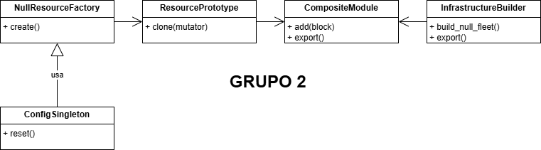

# **Actividad 21: Patrones para módulos de infraestructura**

| Integrante                         | Codigo    | GitHub                                                                  |
| ---------------------------------- | --------- | ----------------------------------------------------------------------- |
| Chowdhury Gomez, Junal Johir       | 20200092K | [JunalChowdhuryG](https://github.com/JunalChowdhuryG/Actividades-CC3S2) |
| La Torre Vasquez, Andres Sebastian | 20212100C | [Jun1el](https://github.com/Jun1el/Desarrollo-de-Software-25-1)         |
| Zapata Inga, Janio Adolfo          | 20212636K | [Janiopi](https://github.com/Janiopi/Actividades-CC3S2)                 |


## **Fase 1: Exploración y análisis**

### **1. Singleton**
#### Tarea: Explica cómo `SingletonMeta` garantiza una sola instancia y el rol del `lock`.

* `_instances` es un diccionario que utiliza `SingletonMeta` que lo utiliza para guardar la unica instancia de cada clase:
    ```python
    _instances: Dict[type, "ConfigSingleton"] = {}
    _lock: threading.Lock = threading.Lock()  # Controla acceso concurrente
    ```
* `__call__` comprueba si la clase tiene una instancia en el 
diccionario `_instances`. En el caso que existiera lo devuelve y en el caso de que no existiera lo crea y lo guarda
    ```python
    def __call__(cls, *args, **kwargs):
        with cls._lock:
            if cls not in cls._instances:
                cls._instances[cls] = super().__call__(*args, **kwargs)
            return cls._instances[cls]
    ```
* el `_lock` asegura que en entornos multihilo no se creen multiples instancias por condiciones de carrera 
Ya que sin `lock` dos hilos podrian verificar `cls not in cls._instances` a la vez y crear dos instancias pero si se utiliza `with cls._lock:` solo un hilo ejecuta el bloque a la vez y esto garantiza que el segundo hilo espere y utilice la instancia creada por el primero

### **2. Factory**
#### Tarea: Detalla cómo la fábrica encapsula la creación de `null_resource` y el propósito de sus `triggers`.
* En el caso de encapsulacion del `null_resource` la fabrica se centra la logica de la creacion del metodo en el metodo estatico `create` el cual genera un diiccionario con estructura JSON para un `null_resource` de Terraform

    ```python
    @staticmethod
    def create(name: str, triggers: Dict[str, Any] | None = None) -> Dict[str, Any]:
        triggers = triggers or {}
        triggers.setdefault("factory_uuid", str(uuid.uuid4()))
        triggers.setdefault("timestamp", datetime.utcnow().isoformat())
        return {
            "resource": [{
                "null_resource": [{
                    name: [{
                        "triggers": triggers
                    }]
                }]
            }]
        }
    ```
    * Existe `abstraccion` ya que el metodo `create` simpplifica la creacion del recurso lo que permite al usuario solo pasar como parametro `name` y opcional el diccionnario de `triggers` ya que la fabrica construye la estructura JSON y esto elimina la necesidad de que el usuario escriba manualmente todo el formato en Terraform

    * Tambien hay `consistencia` ya que existe garantia de que los recursos sigan la misma estructura 

        ```json
        "resource": [{
                    "null_resource": [{
                        name: [{
                            "triggers": triggers
                        }]
                    }]
                }]
        ```
        esto asegura que sea compatible con terraform

* Para el proposito de los `triggers` en un `null_resource` son diccionarios que determina cuando Terraform debe recrear o actualizar el recurso. 
    * Trigger `factory_uuid`: es el identificador unico generado con `uuid.uuid4()` esto asegura que cada recurso que se crea tenga un valor unico, este valor cambia en cada ejecucion
        ```python
        triggers.setdefault("factory_uuid", str(uuid.uuid4()))
        ```
    * Trigger `timestamp`: el timestamp basado en la hora en formato UTC, este valor cambia en cada ejecucion
        ```python
        triggers.setdefault("timestamp", datetime.utcnow().isoformat())
        ```
    Estos `triggers` hacen que cada vez se crea de nuevo el recurso este se marque como `sucio`  

### **3. Prototype**

**Tarea**: Dibuja un diagrama UML del proceso de clonación profunda y explica cómo el mutator permite personalizar cada instancia.

#### UML
- **NullResourceFactory**(Patron Factory)
    - Clase que crea los recursos basicos ```null_resource``` usando la configuracion global definida en ```ConfigSingleton ```
- **ResourcePrototype**(Patron Prototype)
    - Implementa el patrón Prototype para clonar recursos sin alterar el original.
    - Es reutilizado por el Factory y enviado a ```CompositeModule```.
- **CompositeModule**(Patron  Composite)
    - Agrupa multiples recursos en un solo módulo
    - Recibe clones de ```ResourcePrototype```
- **InfrastructureBuilder**(Usa los 3 patrones)
    - Orquesta la construcción de la infraestructura local en Terraform.
    - Usa ```CompositeModule``` para la creacion de recursos
- **ConfigSingleton** 
    - Configuracion global del entorno
   
```python
InfrastructureBuilder
    -> usa NullResourceFactory → crea prototipo base
        -> se clona con ResourcePrototype + mutator
            -> se agregan recursos a CompositeModule
                -> exporta archivo Terraform JSON
ConfigSingleton -> mantiene configuración global
```



#### Mutator
En el patron Prototype el metodo ```clone(mutator)``` hace una copia profunda del objeto prototipo usando ```deepcopy()``` de la libreria ```copy``` que hace que el clon sea independiente al original y que sus cambios no afecten al prototipo original. 

En especifico la funcion ```mutator``` que se encuentra en ```builder.py``` recibe el clon ya duplicado como argumento(en este caso un dict) y  modifica los campos especificos definidos en el codigo en nuestro caso el nombre e insertamos un trigger del indice pero podriamos expandirlo segun nuestras necesidades.

Funcion mutator: 
```python
def mutator(d: Dict[str, Any], idx=i) -> None:
                """
                Función mutadora: modifica el nombre del recurso clonado
                e inserta un trigger identificador con el índice correspondiente.
                """
                res_block = d["resource"][0]["null_resource"][0]
                # Nombre original del recurso (por defecto "placeholder")
                original_name = next(iter(res_block.keys()))
                # Nuevo nombre válido: empieza con letra y contiene índice
                new_name = f"{original_name}_{idx}"
                # Renombramos la clave en el dict
                res_block[new_name] = res_block.pop(original_name)
                # Añadimos el trigger de índice
                res_block[new_name][0]["triggers"]["index"] = idx
```

### **4. Composite**


### **5. Builder**
Este se encarga de sabar cómo estrucuturar un null_resource básico con sus triggers por defecto. El builder simplemente solicita un "modelo" de null_resource

En add_custom_resource

```python

def add_custom_resource(self, name: str, triggers: Dict[str, Any]) -> "InfrastructureBuilder":
        """
        Agrega un recurso null personalizado al módulo compuesto.

        Args:
            name: nombre del recurso.
            triggers: diccionario de triggers personalizados.
        Returns:
            self: permite encadenar llamadas.
        """
        self._module.add(NullResourceFactory.create(name, triggers))
        return self


```

De la misma manera, el builder utiliza NullResourceFactory para generar la estructura correcta de null_resource

### Orquestación de Prototype

En build_null_fleet

```python
        for i in range(count):
            def mutator(d: Dict[str, Any], idx=i) -> None:
                """
                Función mutadora: modifica el nombre del recurso clonado
                e inserta un trigger identificador con el índice correspondiente.
                """
                res_block = d["resource"][0]["null_resource"][0]
                # Nombre original del recurso (por defecto "placeholder")
                original_name = next(iter(res_block.keys()))
                # Nuevo nombre válido: empieza con letra y contiene índice
                new_name = f"{original_name}_{idx}"
                # Renombramos la clave en el dict
                res_block[new_name] = res_block.pop(original_name)
                # Añadimos el trigger de índice
                res_block[new_name][0]["triggers"]["index"] = idx
```

Para crear el fleet dentro del bucle for, el Builder no recrea cada null_resource desde cero, sino usa el prototipo `clone = base_proto.clone(mutator).data `
(copia profunda)

La función mutator es crucial para el patrón Prototype, ya que permite realizar modificaciones específicas en la copia clonada (cambiar el nombre y añadir un index al trigger)

### Orquestación de Composite y generación del JSON final

En

```python
__init__:
    self._module = CompositeModule()
```

El Builder mantiene una única instancia de CompositeModule, el cual irá construyendo de manera incremental.

`self._module.add(clone)`

`self._module.add(NullResourceFactory.create(name, triggers)) `

Después de que Factory y Prototype crean recursos, el Builder los agrega al CompositeModule utilizando el método add.

En

```python
     def export(self, path: str) -> None:
        """
        Exporta el módulo compuesto a un archivo JSON compatible con Terraform.

        Args:
            path: ruta de destino del archivo `.tf.json`.
        """
        data = self._module.export()

        # Asegura que el directorio destino exista
        os.makedirs(os.path.dirname(path), exist_ok=True)

        # Escribe el archivo con indentación legible
        with open(path, "w") as f:
            json.dump(data, f, indent=4)

        print(f"[Builder] Terraform JSON escrito en: {path}")
```

Cuando es momento de finalizar la construcción, el Builder le pide al CompositeModule que exporte todos los recursos que ha recolectado. Luego los unifica y formatea un una estructura que Terraform pueda utilizar.a

## **Fase 2: Ejercicios prácticos**
